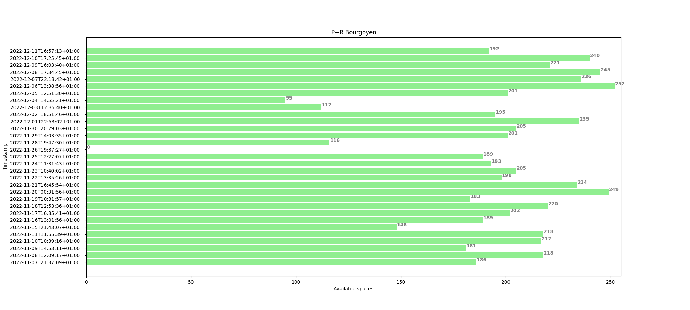
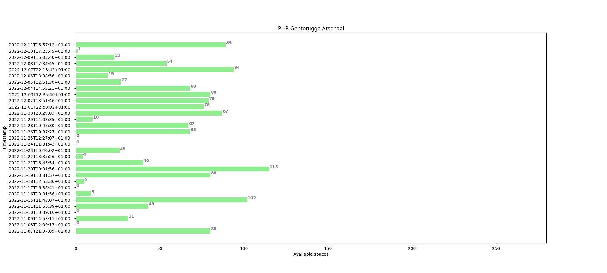
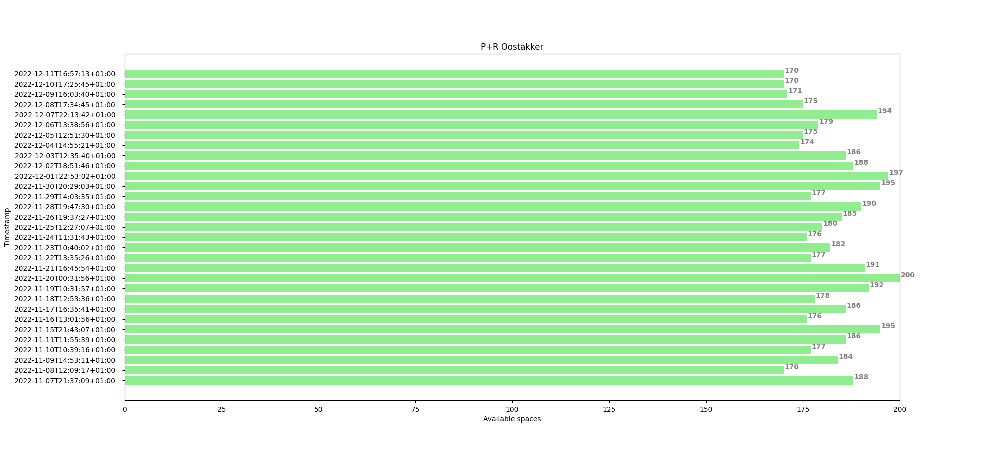
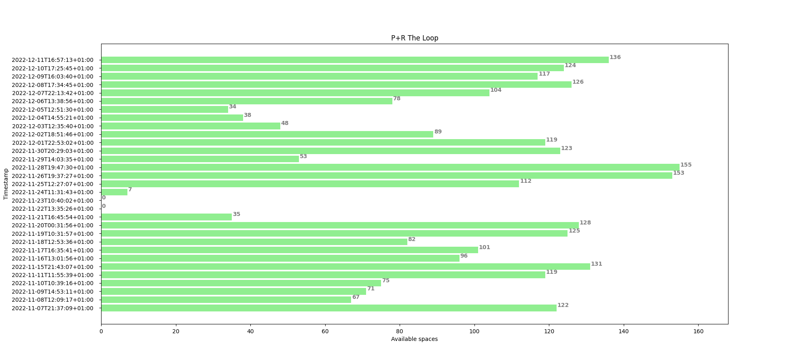
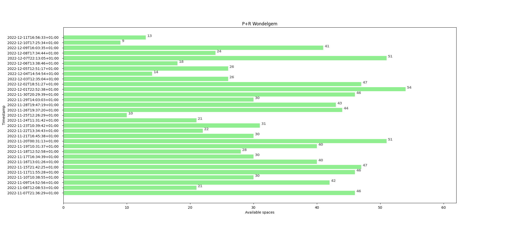
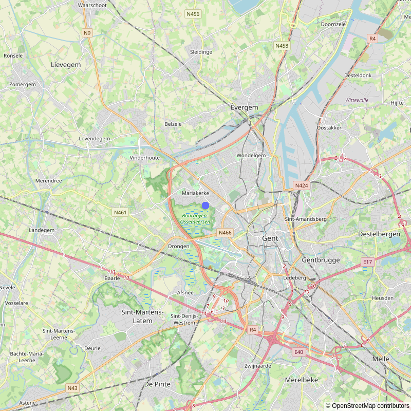
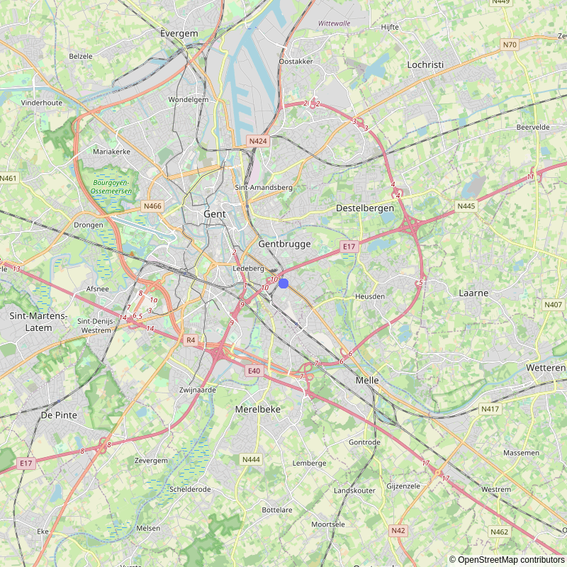
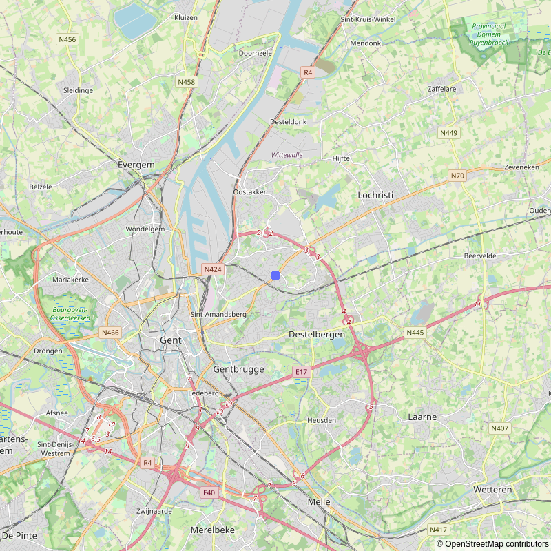
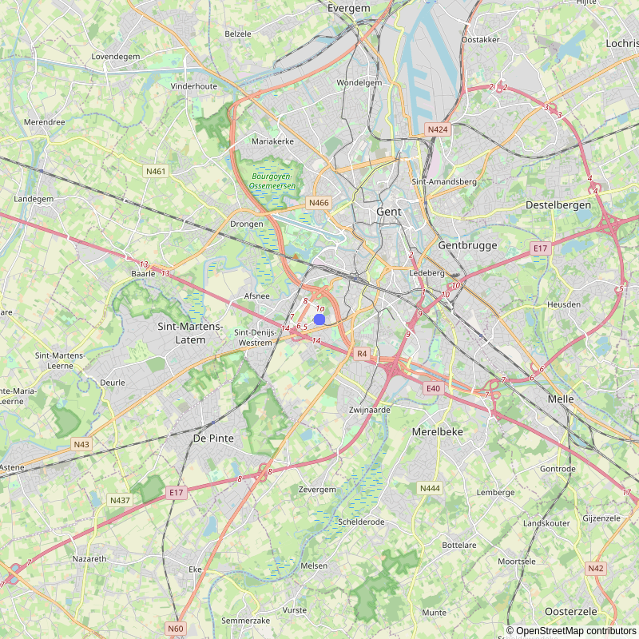
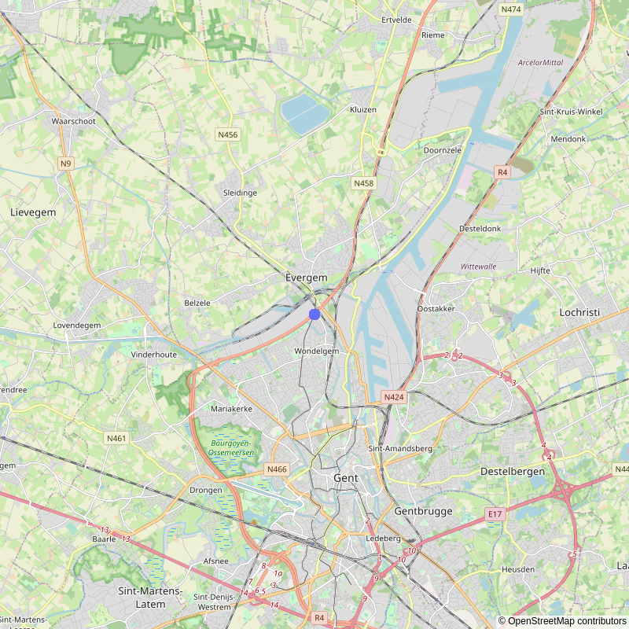

# Rapport

Dit is een rapport over de data van de park and ride zones Bourgoyen, Gentbrugge Arsenaal, Oostakker, The Loop en Wondelgem in Gent.

## Grafieken

### Bourgoyen

Zie 'Bijlagen' onderaan document, Figure 1

### Gentbrugge Arsenaal

Zie 'Bijlagen' onderaan document, Figure 2

### Oostakker

Zie 'Bijlagen' onderaan document, Figure 3

### The Loop

Zie 'Bijlagen' onderaan document, Figure 4

### Wondelgem

Zie 'Bijlagen' onderaan document, Figure 5

## Locaties

### Bourgoyen

Zie 'Bijlagen' onderaan document, Figure 6

### Gentbrugge Arsenaal

Zie 'Bijlagen' onderaan document, Figure 7

### Oostakker

Zie 'Bijlagen' onderaan document, Figure 8

### The Loop

Zie 'Bijlagen' onderaan document, Figure 9

### Wondelgem

Zie 'Bijlagen' onderaan document, Figure 10

## Statistieken

### Bourgoyen
|       |   Total |   Available |   Longitude |     Latitude |
|:------|--------:|------------:|------------:|-------------:|
| count |      31 |     31      | 31          | 31           |
| mean  |     255 |    192.774  |  3.68176    | 51.0674      |
| std   |       0 |     52.4027 |  4.5143e-16 |  1.44458e-14 |
| min   |     255 |      0      |  3.68176    | 51.0674      |
| 25%   |     255 |    187.5    |  3.68176    | 51.0674      |
| 50%   |     255 |    201      |  3.68176    | 51.0674      |
| 75%   |     255 |    220.5    |  3.68176    | 51.0674      |
| max   |     255 |    252      |  3.68176    | 51.0674      |

### Gentbrugge Arsenaal
|       |   Total |   Available |    Longitude |     Latitude |
|:------|--------:|------------:|-------------:|-------------:|
| count |      31 |     31      | 31           | 31           |
| mean  |     280 |     44.4194 |  3.75837     | 51.0325      |
| std   |       0 |     37.2324 |  1.35429e-15 |  2.88915e-14 |
| min   |     280 |      0      |  3.75837     | 51.0325      |
| 25%   |     280 |      7      |  3.75837     | 51.0325      |
| 50%   |     280 |     40      |  3.75837     | 51.0325      |
| 75%   |     280 |     79.5    |  3.75837     | 51.0325      |
| max   |     280 |    115      |  3.75837     | 51.0325      |

### Oostakker
|       |   Total |   Available |   Longitude |   Latitude |
|:------|--------:|------------:|------------:|-----------:|
| count |      31 |    31       | 31          |     31     |
| mean  |     200 |   182.71    |  3.77727    |     51.074 |
| std   |       0 |     8.72618 |  9.0286e-16 |      0     |
| min   |     200 |   170       |  3.77727    |     51.074 |
| 25%   |     200 |   176       |  3.77727    |     51.074 |
| 50%   |     200 |   182       |  3.77727    |     51.074 |
| 75%   |     200 |   189       |  3.77727    |     51.074 |
| max   |     200 |   200       |  3.77727    |     51.074 |

### The Loop
|       |   Total |   Available |   Longitude |     Latitude |
|:------|--------:|------------:|------------:|-------------:|
| count |      31 |     31      |    31       | 31           |
| mean  |     168 |     89.2903 |     3.69519 | 51.0245      |
| std   |       0 |     44.2976 |     0       |  2.88915e-14 |
| min   |     168 |      0      |     3.69519 | 51.0245      |
| 25%   |     168 |     60      |     3.69519 | 51.0245      |
| 50%   |     168 |    101      |     3.69519 | 51.0245      |
| 75%   |     168 |    123.5    |     3.69519 | 51.0245      |
| max   |     168 |    155      |     3.69519 | 51.0245      |

### Wondelgem
|       |   Total |   Available |   Longitude |     Latitude |
|:------|--------:|------------:|------------:|-------------:|
| count |      31 |     31      | 31          | 31           |
| mean  |      62 |     32.9355 |  3.71139    | 51.0985      |
| std   |       0 |     13.1604 |  9.0286e-16 |  7.22288e-15 |
| min   |      62 |      9      |  3.71139    | 51.0985      |
| 25%   |      62 |     23      |  3.71139    | 51.0985      |
| 50%   |      62 |     30      |  3.71139    | 51.0985      |
| 75%   |      62 |     45      |  3.71139    | 51.0985      |
| max   |      62 |     54      |  3.71139    | 51.0985      |

> Dit rapport werd gegenereerd op 11/12/2022 om 16:59 door Kyana Marckx

## Bijlagen

